# Traffic Sign Detection

A YOLOv5 object detector trained to find and classify 13 types of road sign in dashcam style street images. Everything runs in a single Google Colab notebook, from dataset loading through training to inference.

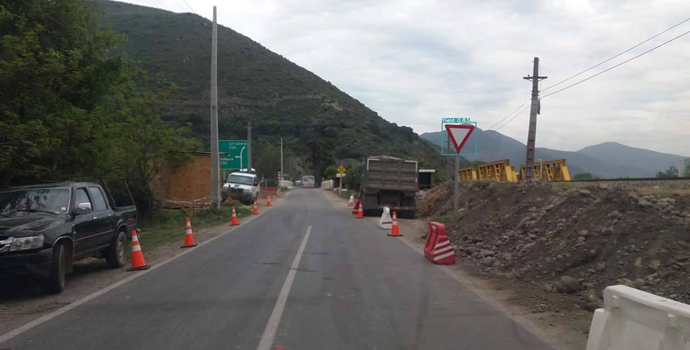

## Contents

- [Overview](#overview)
- [Classes](#classes)
- [Repository layout](#repository-layout)
- [Getting started](#getting-started)
- [Training configuration](#training-configuration)
- [Results](#results)
- [Example detections](#example-detections)
- [Limitations and next steps](#limitations-and-next-steps)
- [Licence](#licence)
- [Acknowledgements](#acknowledgements)

## Overview

- **Model:** YOLOv5s (small) with `BottleneckCSP` blocks, trained from scratch
- **Task:** locate each traffic sign with a bounding box and label it with its class and a confidence score
- **Classes:** 13 regulatory and warning signs
- **Platform:** Google Colab on a Tesla T4 GPU
- **Data format:** YOLO text labels (`class x_centre y_centre width height`, normalised to 0 to 1)

## Classes

| ID | Name | Meaning |
|---:|---|---|
| 0 | `SLimit30` | Speed limit 30 |
| 1 | `SLimit40` | Speed limit 40 |
| 2 | `SLimit50` | Speed limit 50 |
| 3 | `RoundAbout` | Roundabout ahead |
| 4 | `NoEnter` | No entry |
| 5 | `Stop` | Stop |
| 6 | `DriveR` | Keep right |
| 7 | `DriveL` | Keep left |
| 8 | `CrossWay` | Pedestrian crossing |
| 9 | `GoStraight` | Ahead only |
| 10 | `Yield` | Give way |
| 11 | `DontStop` | No stopping |
| 12 | `Parking` | Parking |

## Repository layout

```
.
├── traffic_sign_detection.ipynb   Colab notebook: setup, training, evaluation and inference
├── results/                       Metrics and plots from the 50 epoch training run
│   ├── results.txt                Per epoch losses and metrics (raw YOLOv5 log)
│   ├── results.png                Training and validation curves
│   ├── PR_curve.png               Precision recall curve per class
│   ├── P_curve.png                Precision against confidence
│   ├── R_curve.png                Recall against confidence
│   ├── labels.jpg                 Class and box size distribution of the training labels
│   ├── val_batch2_labels.jpg      Validation batch with ground truth boxes
│   └── val_batch2_pred.jpg        The same batch with model predictions
├── test/                          Sample of 40 test images with YOLO format labels
│   ├── images/
│   └── labels/
├── tested_images/                 Screenshots of detections on unseen images
└── LICENSE
```

The full dataset and the trained weights (`best.pt`) are not stored in this repository because of their size.

## Getting started

1. Prepare the dataset as a zip file with this structure and upload it to Google Drive:

   ```
   trafficSign.zip
   ├── train/  images/  labels/
   ├── valid/  images/  labels/
   └── test/   images/  labels/
   ```

2. Open `traffic_sign_detection.ipynb` in [Google Colab](https://colab.research.google.com/) and switch to a GPU runtime (**Runtime > Change runtime type > GPU**).
3. Edit the configuration cell at the top so `DATASET_ZIP` and `SAVE_DIR` point to your Drive folders.
4. Run the cells in order. The notebook will:
   - clone YOLOv5 (pinned to release `v7.0`) and install its requirements
   - mount Google Drive and extract the dataset
   - write the dataset and model YAML files
   - train the model and save the run to `SAVE_DIR/exp`
   - evaluate the best weights on the test split
   - run detection on the test images and display a few results

Training for 50 epochs at 1216 px takes a few hours on a free Colab T4.

### Running detection with your own weights

Once you have a `best.pt`, detection on any folder of images, a video or a webcam works with the standard YOLOv5 script:

```bash
python detect.py --weights best.pt --img 650 --conf 0.2 --source path/to/images
```

## Training configuration

| Setting | Value |
|---|---|
| Architecture | YOLOv5s (depth 0.33, width 0.50), `BottleneckCSP` backbone and head |
| Initial weights | None (trained from scratch) |
| Image size | 1216 px |
| Batch size | 20 |
| Epochs | 50 |
| Optimiser and augmentation | YOLOv5 defaults |
| Hardware | NVIDIA Tesla T4 (about 14 GB GPU memory in use) |
| Inference | 650 px image size and 0.2 confidence threshold |

## Results

Metrics on the validation set after the final epoch:

| Precision | Recall | mAP@0.5 | mAP@0.5:0.95 |
|---:|---:|---:|---:|
| 0.239 | 0.320 | 0.209 | 0.122 |

The best mAP@0.5 of 0.211 was reached at epoch 42. Losses were still falling when training stopped, which suggests the model had not yet converged.

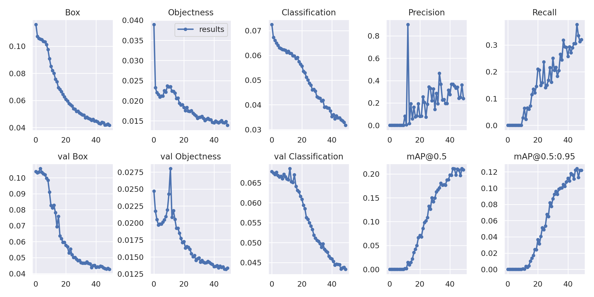

### Per class performance

Average precision at an IoU threshold of 0.5 varies widely between classes. Signs with a distinctive shape or colour are learnt far more easily than the circular blue and speed limit signs, which look alike at small sizes.

| Class | AP@0.5 | | Class | AP@0.5 |
|---|---:|---|---|---:|
| Yield | 0.638 | | DriveR | 0.113 |
| DontStop | 0.556 | | DriveL | 0.099 |
| NoEnter | 0.302 | | SLimit50 | 0.085 |
| Stop | 0.245 | | CrossWay | 0.073 |
| GoStraight | 0.170 | | SLimit30 | 0.070 |
| SLimit40 | 0.168 | | RoundAbout | 0.070 |
| Parking | 0.124 | | **All classes** | **0.209** |

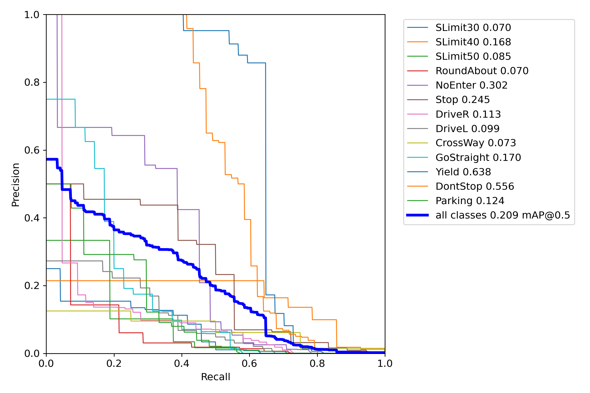

### Validation batch

| Ground truth | Predictions |
|---|---|
| 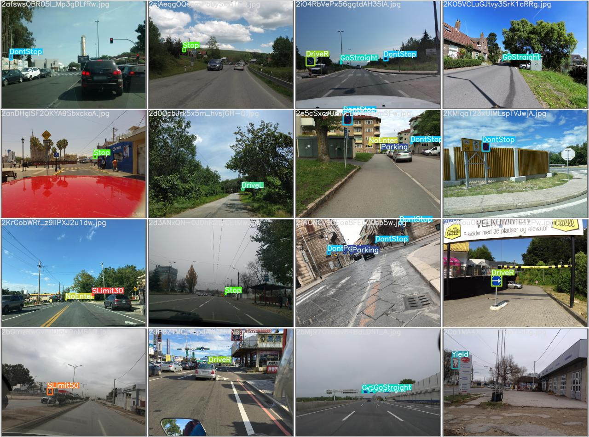 | 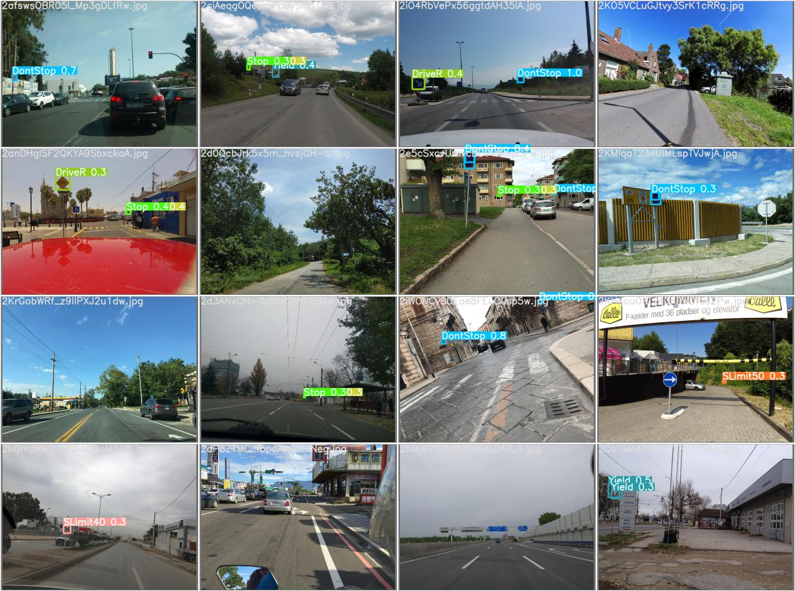 |

## Example detections

Detections on images the model never saw during training:

| | |
|---|---|
| 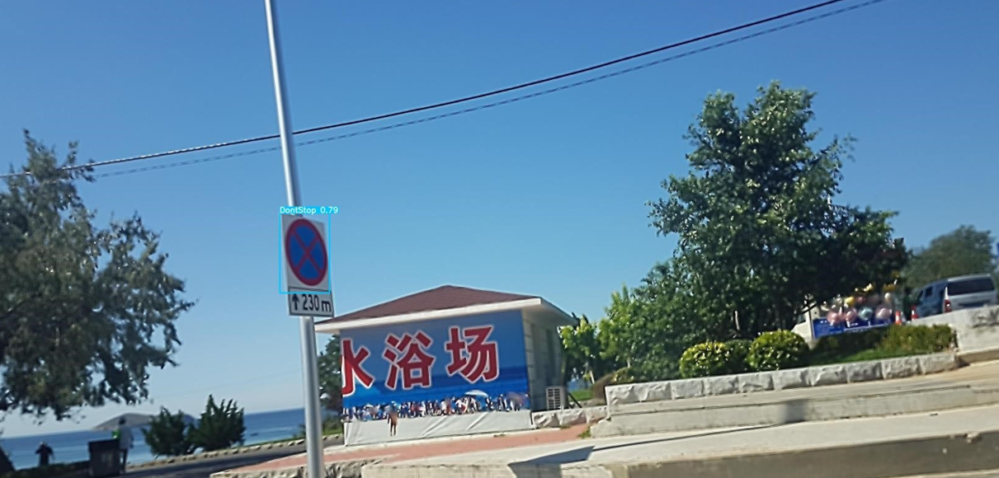 | 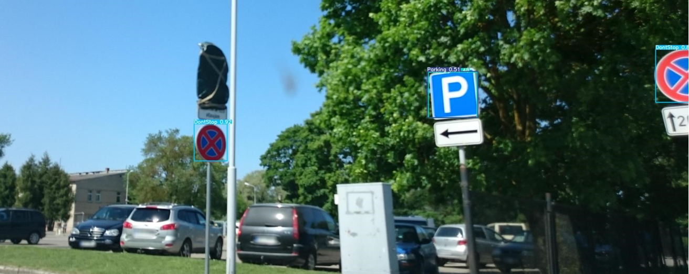 |
| 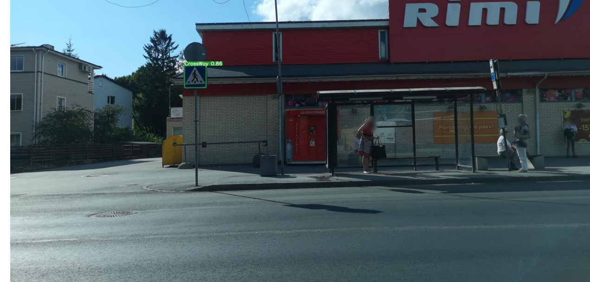 | 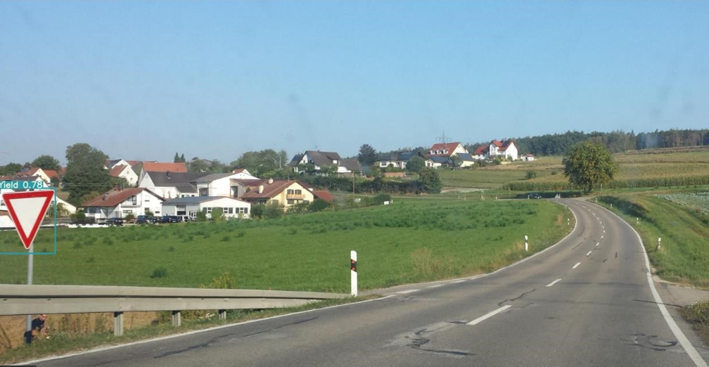 |
| 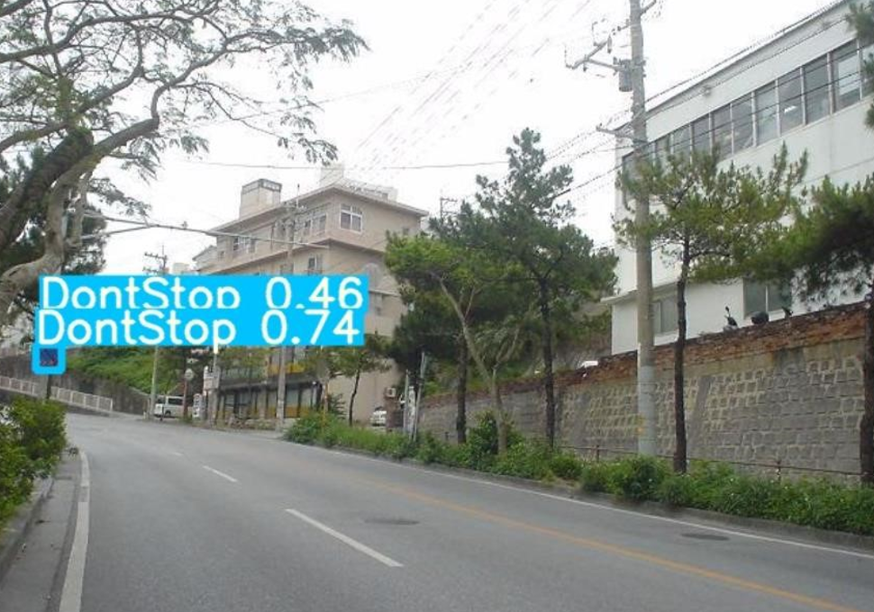 | 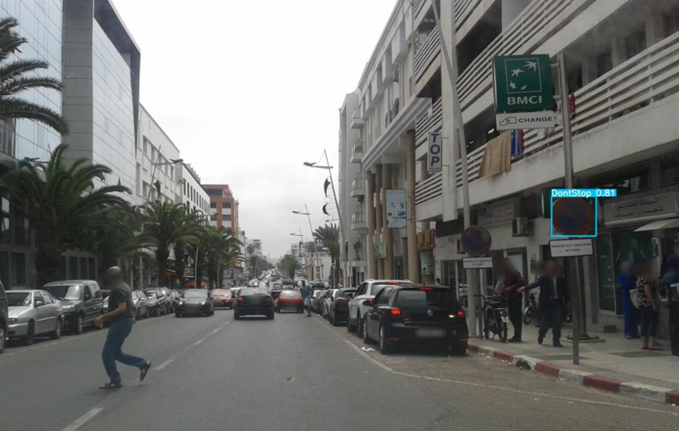 |

## Limitations and next steps

The current model is a working baseline rather than a production ready detector. Signs are usually a tiny fraction of each frame and the model was trained from random initialisation, so recall is low and the speed limit classes are often confused. The most promising improvements are:

- **Start from pretrained weights.** Setting `WEIGHTS = 'yolov5s.pt'` in the notebook fine-tunes from COCO and typically gives a large jump in accuracy on small datasets.
- **Train for longer.** The curves had not flattened after 50 epochs.
- **Balance the classes.** Classes such as `RoundAbout` and `SLimit50` have very few examples, so collecting more data or oversampling them should help.
- **Use a newer architecture.** YOLOv5 `C3` models or YOLOv8 and later are more accurate at a similar speed.
- **Tune for small objects.** Higher input resolution, tiling or anchors recomputed for this dataset can all improve detection of distant signs.

## Licence

The code and documentation in this repository are released under the [MIT License](LICENSE).

[YOLOv5](https://github.com/ultralytics/yolov5) is licensed under AGPL-3.0, which is stricter than MIT. The notebook downloads YOLOv5 at runtime rather than including it in this repository, so the MIT License applies to the files here. However, anyone who builds on a model trained with YOLOv5 or ships it inside a product is also bound by the terms of the AGPL-3.0 licence.

## Acknowledgements

- [Ultralytics YOLOv5](https://github.com/ultralytics/yolov5) for the detection framework and training scripts
- [Google Colab](https://colab.research.google.com/) for the free GPU runtime
